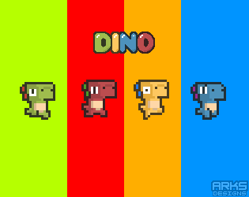

# My Little Dino

## Introduction

My Little Dino is a game, a DEX, a liquidity pool opportunity, a market of rare utility driven NFTs, and it all plays out seamlessly in an interactive, online battle royale. We’re excited to release the My Little Dino universe to the world. Come join our lovely community!&#x20;

### The motivation for creating My Little Dino

Of course this project has a huge influence from DeFi Kingdoms, the original DEX NFT-based game on the Harmony Network; however, we’re big fans of the innovation happening with NFTs, DeFi and blockchain technology in general as well. We've been waiting to make a DeFi project to really embrace the full potential of the blockchain in game form. Investing and getting those sweet returns and moon shots is undoubtedly fun, but why can't it feel more like a game? Why can't we build an operation and level it up to increase my returns. Why can't we do a multiplayer game to collect rare NFTs that actually augment and impact the rewards and returns? Once we decided it needed to be built, we jumped head first into production, and My Little Dino was evolved!

#### A strategically assembled team with a shared vision

We wanted to also build a platform to attract a larger audience and blockchain community, especially the youth. Therefore, we are packaging a fun multiplayer game, providing DINO token holders with an engaging and meaningful experience. We are considering making the game multi-chain as well by making My Little Dino compatible with the Terra-Luna blockchain network. We are here to stay for quite some time, with the intent to create a community of blockchain enthusiasts for the underprivileged that do not grasp the possibilities of blockchain technology. So why not build an awesome game to help illustrate the message.
